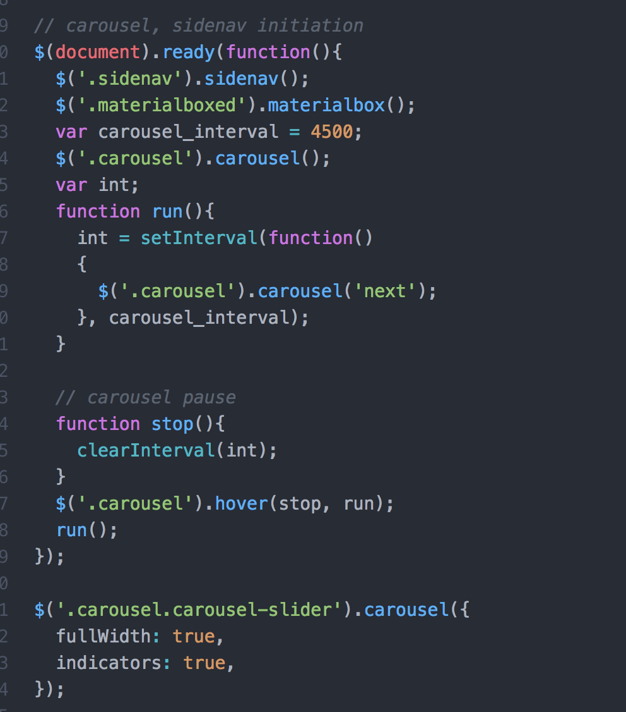
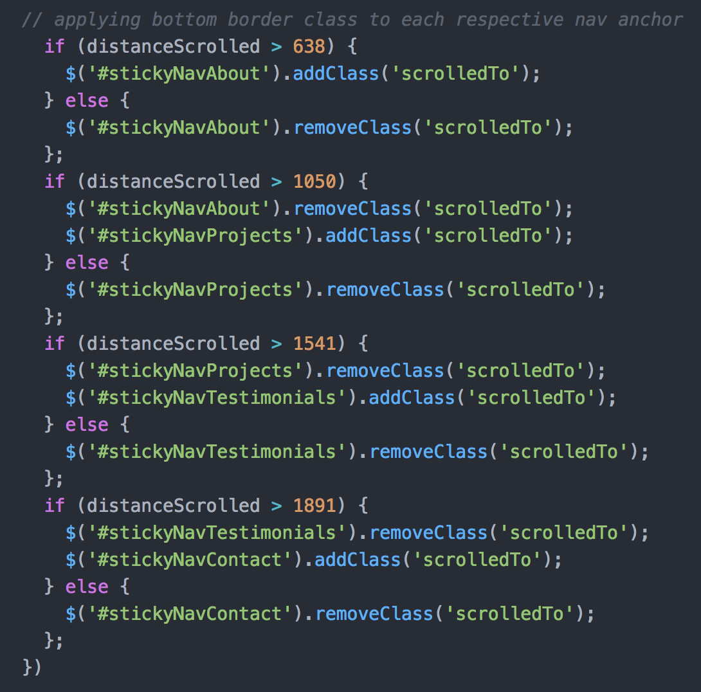

Welcome to Project 0, my Portfolio site! I hope you enjoy yourself!

My goal for this project is to first get a working version of a portfolio site, covering all essentials of my web development work thus far (and with a bit of a personal touch) with simple enough functionality to do what I want it to, and airtight technologies. I want the site's foundation to be solid, and something that I can build upon throughout my career, as I gain more knowledge of, and expertise in, additional technologies and languages.

In addition to my own HTML, CSS, JavaScript and jQuery, I used the Materialize plug-in to implement image and content carousels, as well as a hamburger menu. While I tried to minimize any use of the plugin's styles, outside of what I needed for the carousel and hamburger menu, I did use a bit of Materialize's style for my contact form.

My biggest struggle with this project was to add pause and zoom functionality to Materialize's carousel. Materialize does have native lightbox functionality, but the method they offer does not work smoothly with their Carousel technology. Furthermore, their Carousel does not have a built-in method for pausing its auto-scroll.

In order to effectively combine the functionalities to get the result I wanted, I added additional nested divs to my image cards, so that the zoom was not acting on the images themselves. I then added a jQuery variable to moderate the scrolling/pausing functions, which would be triggered by hovering over the carousel.

Here is the jQuery I used:

Another interesting challenge I faced, was to get my nav anchors to highlight when their respective sections are scrolled to. Getting them to highlight/remove highlight when clicked was simple enough. Getting them to highlight on scroll involved adding a variable to track the distance scrolled from the top of the viewport window, and then add/remove classes as needed.

Here is the jQuery I used:

Over time, I want to continue to modify the site with more personal touches. Creativity is one of my weaker areas, and tends to happen over longer stretches of time.

Additionally, one major challenge I'm still facing involves the two Materialize carousels being tied together - both will scroll/pause/restart in unison, and actions on one have an effect on the other, so I still need to add a class or ID to one of the carousels to prevent this from happening. I also need to play with the dreaded Z-Index, so that the image zoom pops out above the content carousel (and the content carousel does not have any zoom effects). And finally, I need to tweak the sizing of the image descriptions/links, as there's a lot of extra white space there. Hope you enjoy!
